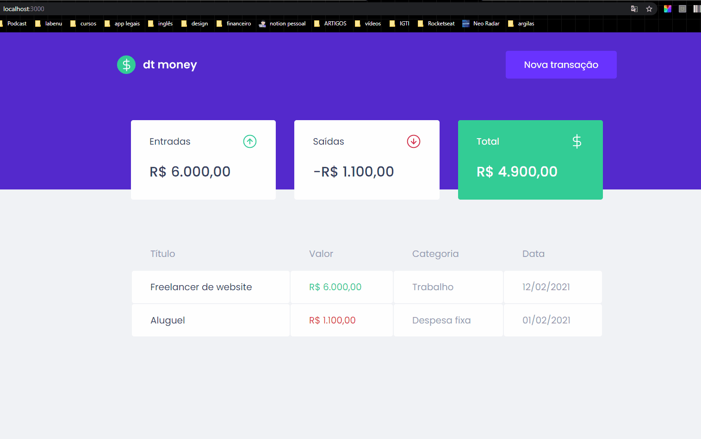

<h1 align="center"> EVERY MONEY </h1>

##### Front-end project with React.js, Next.js, TypeScript, Mirage.js
##### Project developed during the Rocketseat course - [Rocketseat](https://rocketseat.com.br/)
##### Teacher: [Diego Fernandes](https://github.com/diego3g)

<hr/>

### Sumary:
- :rocket: [Description](#rocket-description)
- 👨‍💻️ [Technologies](#%EF%B8%8F-technologies)
- 📦️ [How use](#%EF%B8%8F-how-use)

<hr/>


## :rocket: Description:
This applications is an personal finance manager.

##### Functionalities:
* Add new cash outflow
* Add new cash inflow
* Calculate total expenses
* Calculate total entries
* Calculate your total balance
List all registered cash transactions
* Registration dates


---

## 👨‍💻️ Technologies

- [ReactJS](https://reactjs.org/)
- [TypeScript]
- [NextJS]
- MirageJS
- Axios
- Styled Components
- Polished
- 100% Teststed 


### IDE

- [Visual Studio Code](https://code.visualstudio.com/)

---

## 📦️ How use

To copy:

```bash
  # Repository clone:
  ❯ git clone https://github.com/TatianaFischer/every-money-ignite.git

  # Enter the repository:
  ❯ cd every-money-ignite
```

To install the dependencies and start the project, you can use Yarn ou NPM:

** yarn**

```bash
  # Install
  ❯ yarn

  # Inicial
  ❯ yarn start
```

** npm**

```bash
  # Install
  ❯ npm install

  # Inicial
  ❯ npm start
```

<p>
---  
  
  
 
--- 
</p>


<h4 align="center">
  Feito por Tatiana Fischer 👋️
 
</h4>
<h4 align="center">
[Linkedin](https://www.linkedin.com/in/tatianaffischer/)
</h4>
